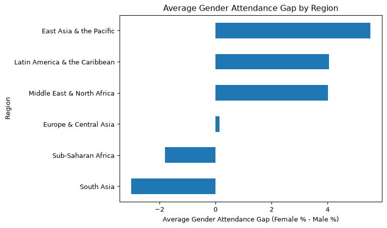
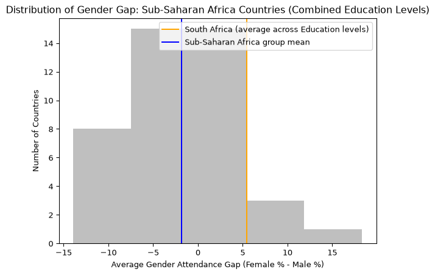
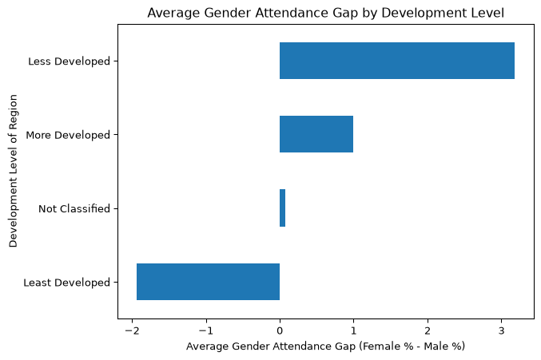
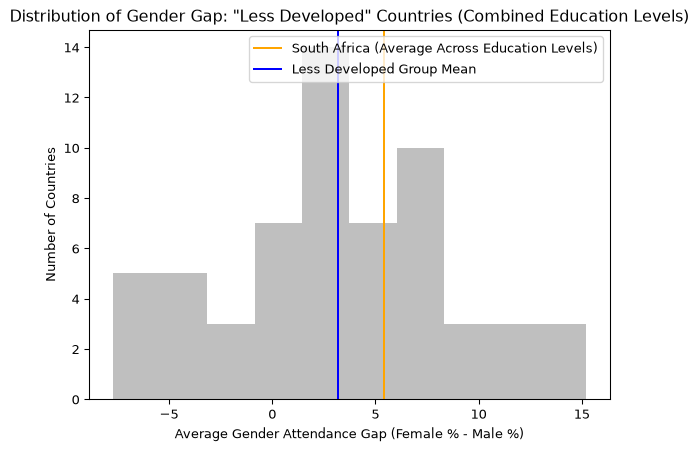
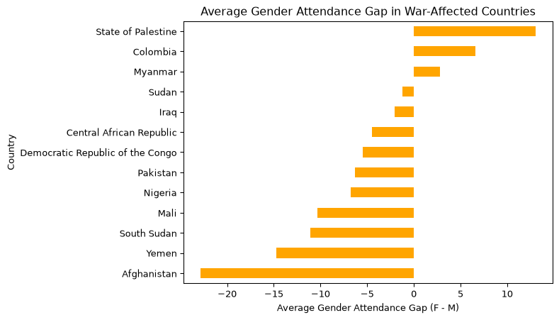

# Python Project: Education Completion Rates Across Countries


## The Prompt

How do global school attendance rates differ by gender, and what
patterns emerge across regions and levels of development?

## Supproting Questions

Does the direction of the gender gap differ across regions?

How does South Africa compare with the broader regional trend?

How does the gender gap change with a country’s level of development?

Is South Africa unique, or does it reflect the broader attendance
patterns and gender disparities observed across other less developed
countries?

## Setup

## Import environments

For Exploration/ Claculations

``` python
import pandas as pd
import statsmodels.api as sm
```

For Graphs

``` python
import seaborn as sns
import matplotlib.pyplot as plt
```

## In Terminal

pip3 install openpyxl This allows the excel file to be read.

## Importing in the Data

``` python
file_path = '~/Library/Mobile Documents/com~apple~CloudDocs/MSBAAcademics/Python/PotentialDataSets/CompletionRateData.xlsx'
```

``` python
unicef_data_primary = pd.read_excel(file_path, sheet_name='Primary')

unicef_data_lower = pd.read_excel(file_path, sheet_name='Lower secondary')

unicef_data_upper =pd.read_excel(file_path, sheet_name='Upper secondary')
```

(Imported as seperate Data Frames)

## Initial Exploration

Look at the first & last 5 rows of each sheet, & shape

``` python
unicef_data_primary.head()
unicef_data_primary.tail()
unicef_data_primary.shape
```

    (219, 23)

``` python
unicef_data_lower.head()
unicef_data_lower.tail()
unicef_data_lower.shape
```

    (219, 23)

``` python
unicef_data_upper.head()
unicef_data_upper.tail()
unicef_data_upper.shape
```

    (219, 23)

## Concatenate the 3 data frames into 1 data frame (df)

First add an Education Level Column called Level

``` python
unicef_data_primary['Level'] = 'Primary'
unicef_data_lower['Level'] = 'Lower secondary'
unicef_data_upper['Level'] = 'Upper secondary'
```

Concatnate all 3 data frames/ sheets

``` python
unicef_all = pd.concat([
    unicef_data_primary,
    unicef_data_lower,
    unicef_data_upper
])
```

## Cleaning the Data

## Renaming

View Column names

``` python
unicef_all.columns
```

    Index(['ISO3', 'Country', 'Region', 'Sub-region', 'Development Regions',
           'Total', 'Gender_Female', 'Gender_Male', 'Residence_Rural',
           'Residence_Urban', 'WealthQuintile_Poorest', 'WealthQuintile_Second',
           'WealthQuintile_Middle', 'WealthQuintile_Fourth',
           'WealthQuintile_Richest', 'Data source', 'Time period',
           'Population data', 'Unnamed: 18', 'Unnamed: 19', 'Unnamed: 20',
           'Unnamed: 21', 'Unnamed: 22', 'Level'],
          dtype='str')

Create a funtion to rename the columns, & save the changes

``` python
def rename_columns(df):
    df = df.rename(columns = {'ISO3': 'Country Abbreviation',
        'Total': 'Total Attendance (%)',
        'Gender_Female': 'Female Attendance (%)',
        'Gender_Male': 'Male Attendance (%)',
        'Residence_Rural': 'Rural Attendance (%)',
        'Residence_Urban': 'Urban Attendance (%)',
        'WealthQuintile_Poorest': 'Poorest Quintile Attendance (%)',
        'WealthQuintile_Second': 'Second Quintile Attendance (%)',
        'WealthQuintile_Middle': 'Middle Quintile Attendance (%)',
        'WealthQuintile_Fourth': 'Fourth Quintile Attendance (%)',
        'WealthQuintile_Richest': 'Richest Quintile Attendance (%)'
        })
    return df
# the 'df =' means the new names will replace the old ones
```

Run the function

``` python
unicef_all = rename_columns(unicef_all)
```

## Clarity on Column content/ Dictionaries

Dictionary for region names

``` python
unicef_all["Region"].unique()
```

    <StringArray>
    ['SA', 'ECA', 'MENA', 'SSA', 'LAC', 'EAP', nan]
    Length: 7, dtype: str

Dictionary for region names

``` python
region_names = {'SA': 'South Asia',
    'ECA': 'Europe & Central Asia',
    'MENA': 'Middle East & North Africa',
    'SSA': 'Sub-Saharan Africa',
    'LAC': 'Latin America & the Caribbean',
    'EAP': 'East Asia & the Pacific'
}
```

Option to Apply Dictionary: Instead of Applying Dictionaries you can
also use get() with your result if you need more than the abbreviation.

``` python
unicef_all['Region'] = unicef_all['Region'].map(region_names)
```

Dictionary for sub-region names

``` python
unicef_all["Sub-region"].unique()
```

    <StringArray>
    ['SA', 'EECA', 'MENA', 'WE', 'ESA', 'LAC', 'EAP', 'WCA', nan]
    Length: 9, dtype: str

``` python
subregion_names = {'SA': 'South Asia',
    'EECA': 'Eastern Europe & Central Asia',
    'MENA': 'Middle East & North Africa',
    'WE': 'Western Europe',
    'ESA': 'Eastern & Southern Africa',
    'LAC': 'Latin America & the Caribbean',
    'EAP': 'East Asia & the Pacific',
    'WCA': 'West & Central Africa'
}
```

Option to Apply Dictionary: Instead of Applying Dictionaries you can
also use get() with your result if you need more than the abbreviation.

``` python
unicef_all['Sub-region'] = unicef_all['Sub-region'].map(subregion_names)
```

## Remove unnamed columns

``` python
unicef_all.columns

unicef_all = unicef_all.drop(columns = [ 
    'Unnamed: 18', 
    'Unnamed: 19', 
    'Unnamed: 20',
    'Unnamed: 21', 
    'Unnamed: 22'
])
```

## Exploration of unicef_all

``` python
unicef_all
```

<div>
<style scoped>
    .dataframe tbody tr th:only-of-type {
        vertical-align: middle;
    }
&#10;    .dataframe tbody tr th {
        vertical-align: top;
    }
&#10;    .dataframe thead th {
        text-align: right;
    }
</style>

|  | Country Abbreviation | Country | Region | Sub-region | Development Regions | Total Attendance (%) | Female Attendance (%) | Male Attendance (%) | Rural Attendance (%) | Urban Attendance (%) | Poorest Quintile Attendance (%) | Second Quintile Attendance (%) | Middle Quintile Attendance (%) | Fourth Quintile Attendance (%) | Richest Quintile Attendance (%) | Data source | Time period | Population data | Level |
|----|----|----|----|----|----|----|----|----|----|----|----|----|----|----|----|----|----|----|----|
| 0 | AFG | Afghanistan | South Asia | South Asia | Least Developed | 53.900002 | 4.020000e+01 | 6.720000e+01 | 47.799999 | 70.800003 | 44.500000 | 46.000000 | 42.599998 | 60.000000 | 74.500000 | DHS 2015 | 2015.0 | 6422789.0 | Primary |
| 1 | ALB | Albania | Europe & Central Asia | Eastern Europe & Central Asia | More Developed | 94.921280 | 9.569837e+01 | 9.415596e+01 | 93.074661 | 96.308372 | 93.340530 | 93.469879 | 95.767410 | 94.290802 | 97.969856 | DHS 2017-18 | 2018.0 | 165268.0 | Primary |
| 2 | DZA | Algeria | Middle East & North Africa | Middle East & North Africa | Less Developed | 94.708633 | 9.647162e+01 | 9.307437e+01 | 92.381554 | 95.936897 | 87.733833 | 93.385323 | 96.337517 | 97.667519 | 98.906937 | MICS 2019 | 2020.0 | 4497034.0 | Primary |
| 3 | AND | Andorra | Europe & Central Asia | Western Europe | More Developed | NaN | NaN | NaN | NaN | NaN | NaN | NaN | NaN | NaN | NaN | NaN | NaN | 3913.0 | Primary |
| 4 | AGO | Angola | Sub-Saharan Africa | Eastern & Southern Africa | Least Developed | 59.849659 | 5.663134e+01 | 6.327890e+01 | 27.187010 | 73.655067 | 18.803400 | 30.390791 | 60.571880 | 76.826424 | 89.008347 | DHS 2015-16 | 2016.0 | 6029594.0 | Primary |
| ... | ... | ... | ... | ... | ... | ... | ... | ... | ... | ... | ... | ... | ... | ... | ... | ... | ... | ... | ... |
| 214 | NaN | Sub-Saharan Africa | Sub-Saharan Africa | NaN | NaN | 0.972007 | 7.374666e+07 | 7.168227e+07 | NaN | NaN | NaN | NaN | NaN | NaN | NaN | NaN | NaN | NaN | Upper secondary |
| 215 | NaN | Eastern & Southern Africa | NaN | Eastern & Southern Africa | NaN | 0.943309 | 3.505918e+07 | 3.307164e+07 | NaN | NaN | NaN | NaN | NaN | NaN | NaN | NaN | NaN | NaN | Upper secondary |
| 216 | NaN | West & Central Africa | NaN | West & Central Africa | NaN | 0.998014 | 3.868748e+07 | 3.861063e+07 | NaN | NaN | NaN | NaN | NaN | NaN | NaN | NaN | NaN | NaN | Upper secondary |
| 217 | NaN | Least developed countries | NaN | NaN | LDC | 0.970764 | 6.789422e+07 | 6.590925e+07 | NaN | NaN | NaN | NaN | NaN | NaN | NaN | NaN | NaN | NaN | Upper secondary |
| 218 | NaN | World | NaN | NaN | NaN | 0.849574 | 3.984294e+08 | 3.384952e+08 | NaN | NaN | NaN | NaN | NaN | NaN | NaN | NaN | NaN | NaN | Upper secondary |

<p>657 rows × 19 columns</p>
</div>

First 5 rows

``` python
unicef_all.head()
```

<div>
<style scoped>
    .dataframe tbody tr th:only-of-type {
        vertical-align: middle;
    }
&#10;    .dataframe tbody tr th {
        vertical-align: top;
    }
&#10;    .dataframe thead th {
        text-align: right;
    }
</style>

|  | Country Abbreviation | Country | Region | Sub-region | Development Regions | Total Attendance (%) | Female Attendance (%) | Male Attendance (%) | Rural Attendance (%) | Urban Attendance (%) | Poorest Quintile Attendance (%) | Second Quintile Attendance (%) | Middle Quintile Attendance (%) | Fourth Quintile Attendance (%) | Richest Quintile Attendance (%) | Data source | Time period | Population data | Level |
|----|----|----|----|----|----|----|----|----|----|----|----|----|----|----|----|----|----|----|----|
| 0 | AFG | Afghanistan | South Asia | South Asia | Least Developed | 53.900002 | 40.200001 | 67.199997 | 47.799999 | 70.800003 | 44.500000 | 46.000000 | 42.599998 | 60.000000 | 74.500000 | DHS 2015 | 2015.0 | 6422789.0 | Primary |
| 1 | ALB | Albania | Europe & Central Asia | Eastern Europe & Central Asia | More Developed | 94.921280 | 95.698372 | 94.155960 | 93.074661 | 96.308372 | 93.340530 | 93.469879 | 95.767410 | 94.290802 | 97.969856 | DHS 2017-18 | 2018.0 | 165268.0 | Primary |
| 2 | DZA | Algeria | Middle East & North Africa | Middle East & North Africa | Less Developed | 94.708633 | 96.471619 | 93.074371 | 92.381554 | 95.936897 | 87.733833 | 93.385323 | 96.337517 | 97.667519 | 98.906937 | MICS 2019 | 2020.0 | 4497034.0 | Primary |
| 3 | AND | Andorra | Europe & Central Asia | Western Europe | More Developed | NaN | NaN | NaN | NaN | NaN | NaN | NaN | NaN | NaN | NaN | NaN | NaN | 3913.0 | Primary |
| 4 | AGO | Angola | Sub-Saharan Africa | Eastern & Southern Africa | Least Developed | 59.849659 | 56.631340 | 63.278900 | 27.187010 | 73.655067 | 18.803400 | 30.390791 | 60.571880 | 76.826424 | 89.008347 | DHS 2015-16 | 2016.0 | 6029594.0 | Primary |

</div>

Last 5 rows: The last few rows are summaries

``` python
unicef_all.tail()
```

<div>
<style scoped>
    .dataframe tbody tr th:only-of-type {
        vertical-align: middle;
    }
&#10;    .dataframe tbody tr th {
        vertical-align: top;
    }
&#10;    .dataframe thead th {
        text-align: right;
    }
</style>

|  | Country Abbreviation | Country | Region | Sub-region | Development Regions | Total Attendance (%) | Female Attendance (%) | Male Attendance (%) | Rural Attendance (%) | Urban Attendance (%) | Poorest Quintile Attendance (%) | Second Quintile Attendance (%) | Middle Quintile Attendance (%) | Fourth Quintile Attendance (%) | Richest Quintile Attendance (%) | Data source | Time period | Population data | Level |
|----|----|----|----|----|----|----|----|----|----|----|----|----|----|----|----|----|----|----|----|
| 214 | NaN | Sub-Saharan Africa | Sub-Saharan Africa | NaN | NaN | 0.972007 | 73746660.0 | 71682266.0 | NaN | NaN | NaN | NaN | NaN | NaN | NaN | NaN | NaN | NaN | Upper secondary |
| 215 | NaN | Eastern & Southern Africa | NaN | Eastern & Southern Africa | NaN | 0.943309 | 35059185.0 | 33071637.0 | NaN | NaN | NaN | NaN | NaN | NaN | NaN | NaN | NaN | NaN | Upper secondary |
| 216 | NaN | West & Central Africa | NaN | West & Central Africa | NaN | 0.998014 | 38687475.0 | 38610629.0 | NaN | NaN | NaN | NaN | NaN | NaN | NaN | NaN | NaN | NaN | Upper secondary |
| 217 | NaN | Least developed countries | NaN | NaN | LDC | 0.970764 | 67894222.0 | 65909248.0 | NaN | NaN | NaN | NaN | NaN | NaN | NaN | NaN | NaN | NaN | Upper secondary |
| 218 | NaN | World | NaN | NaN | NaN | 0.849574 | 398429438\.0 | 338495202\.0 | NaN | NaN | NaN | NaN | NaN | NaN | NaN | NaN | NaN | NaN | Upper secondary |

</div>

``` python
unicef_all.info()
```

    <class 'pandas.DataFrame'>
    Index: 657 entries, 0 to 218
    Data columns (total 19 columns):
     #   Column                           Non-Null Count  Dtype  
    ---  ------                           --------------  -----  
     0   Country Abbreviation             609 non-null    str    
     1   Country                          651 non-null    str    
     2   Region                           621 non-null    str    
     3   Sub-region                       612 non-null    str    
     4   Development Regions              609 non-null    str    
     5   Total Attendance (%)             375 non-null    float64
     6   Female Attendance (%)            375 non-null    float64
     7   Male Attendance (%)              375 non-null    float64
     8   Rural Attendance (%)             333 non-null    float64
     9   Urban Attendance (%)             333 non-null    float64
     10  Poorest Quintile Attendance (%)  318 non-null    float64
     11  Second Quintile Attendance (%)   315 non-null    float64
     12  Middle Quintile Attendance (%)   315 non-null    float64
     13  Fourth Quintile Attendance (%)   315 non-null    float64
     14  Richest Quintile Attendance (%)  315 non-null    float64
     15  Data source                      335 non-null    str    
     16  Time period                      335 non-null    float64
     17  Population data                  606 non-null    float64
     18  Level                            657 non-null    str    
    dtypes: float64(12), str(7)
    memory usage: 102.7 KB

## Convert Data types of object to float64

Function for type change

``` python
def type_change(df, column_name):
    df[column_name] = pd.to_numeric(df[column_name], errors="coerce")
```

For loop: all object columns

``` python
attendance_columns = [
    'Total Attendance (%)',
    'Female Attendance (%)',
    'Male Attendance (%)',
    'Rural Attendance (%)',
    'Urban Attendance (%)',
    'Poorest Quintile Attendance (%)',
    'Second Quintile Attendance (%)',
    'Middle Quintile Attendance (%)',
    'Fourth Quintile Attendance (%)',
    'Richest Quintile Attendance (%)'
]

for i in attendance_columns:
    type_change(unicef_all, i)
```

Check if it changed the objects to floats

``` python
unicef_all.info()
```

    <class 'pandas.DataFrame'>
    Index: 657 entries, 0 to 218
    Data columns (total 19 columns):
     #   Column                           Non-Null Count  Dtype  
    ---  ------                           --------------  -----  
     0   Country Abbreviation             609 non-null    str    
     1   Country                          651 non-null    str    
     2   Region                           621 non-null    str    
     3   Sub-region                       612 non-null    str    
     4   Development Regions              609 non-null    str    
     5   Total Attendance (%)             375 non-null    float64
     6   Female Attendance (%)            375 non-null    float64
     7   Male Attendance (%)              375 non-null    float64
     8   Rural Attendance (%)             333 non-null    float64
     9   Urban Attendance (%)             333 non-null    float64
     10  Poorest Quintile Attendance (%)  318 non-null    float64
     11  Second Quintile Attendance (%)   315 non-null    float64
     12  Middle Quintile Attendance (%)   315 non-null    float64
     13  Fourth Quintile Attendance (%)   315 non-null    float64
     14  Richest Quintile Attendance (%)  315 non-null    float64
     15  Data source                      335 non-null    str    
     16  Time period                      335 non-null    float64
     17  Population data                  606 non-null    float64
     18  Level                            657 non-null    str    
    dtypes: float64(12), str(7)
    memory usage: 102.7 KB

``` python
unicef_all.sort_values('Total Attendance (%)', ascending = True)
```

<div>
<style scoped>
    .dataframe tbody tr th:only-of-type {
        vertical-align: middle;
    }
&#10;    .dataframe tbody tr th {
        vertical-align: top;
    }
&#10;    .dataframe thead th {
        text-align: right;
    }
</style>

|  | Country Abbreviation | Country | Region | Sub-region | Development Regions | Total Attendance (%) | Female Attendance (%) | Male Attendance (%) | Rural Attendance (%) | Urban Attendance (%) | Poorest Quintile Attendance (%) | Second Quintile Attendance (%) | Middle Quintile Attendance (%) | Fourth Quintile Attendance (%) | Richest Quintile Attendance (%) | Data source | Time period | Population data | Level |
|----|----|----|----|----|----|----|----|----|----|----|----|----|----|----|----|----|----|----|----|
| 209 | NaN | Western Europe | NaN | Western Europe | NaN | 0.0 | 28221211.0 | 0.0 | NaN | NaN | NaN | NaN | NaN | NaN | NaN | NaN | NaN | NaN | Primary |
| 212 | NaN | North America | NaN | NaN | NaN | 0.0 | 13687769.0 | 0.0 | NaN | NaN | NaN | NaN | NaN | NaN | NaN | NaN | NaN | NaN | Lower secondary |
| 212 | NaN | North America | NaN | NaN | NaN | 0.0 | 26877187.0 | 0.0 | NaN | NaN | NaN | NaN | NaN | NaN | NaN | NaN | NaN | NaN | Primary |
| 212 | NaN | North America | NaN | NaN | NaN | 0.0 | 13666235.0 | 0.0 | NaN | NaN | NaN | NaN | NaN | NaN | NaN | NaN | NaN | NaN | Upper secondary |
| 209 | NaN | Western Europe | NaN | Western Europe | NaN | 0.0 | 19414236.0 | 0.0 | NaN | NaN | NaN | NaN | NaN | NaN | NaN | NaN | NaN | NaN | Lower secondary |
| ... | ... | ... | ... | ... | ... | ... | ... | ... | ... | ... | ... | ... | ... | ... | ... | ... | ... | ... | ... |
| 197 | VUT | Vanuatu | East Asia & the Pacific | East Asia & the Pacific | Least Developed | NaN | NaN | NaN | NaN | NaN | NaN | NaN | NaN | NaN | NaN | NaN | NaN | 18588.0 | Upper secondary |
| 198 | VEN | Venezuela (Bolivarian Republic of) | Latin America & the Caribbean | Latin America & the Caribbean | Less Developed | NaN | NaN | NaN | NaN | NaN | NaN | NaN | NaN | NaN | NaN | NaN | NaN | 1034975.0 | Upper secondary |
| 203 | NaN | NaN | NaN | NaN | NaN | NaN | NaN | NaN | NaN | NaN | NaN | NaN | NaN | NaN | NaN | NaN | NaN | NaN | Upper secondary |
| 204 | NaN | NaN | NaN | NaN | NaN | NaN | NaN | NaN | NaN | NaN | NaN | NaN | NaN | NaN | NaN | NaN | NaN | NaN | Upper secondary |
| 205 | NaN | Population coverage | NaN | NaN | NaN | NaN | NaN | NaN | NaN | NaN | NaN | NaN | NaN | NaN | NaN | NaN | NaN | NaN | Upper secondary |

<p>657 rows × 19 columns</p>
</div>

This data contains summary rows For summary rows: Country Abbreviation =
NaN \## Filter out summary rows

``` python
unicef_all = unicef_all[unicef_all['Country Abbreviation'].notna()]
```

## Calculations

Start with calculations now that the types are adjusted: \## Create
Gender Gap column

``` python
unicef_all['Gender Attendance Gap (F-M)'] = (
    unicef_all['Female Attendance (%)'] - unicef_all['Male Attendance (%)'])
```

Positive values mean female attendance is higher than male attendance in
that row -\> negative values mean male attendance is higher.

``` python
unicef_all[['Country', 'Region', 
            'Sub-region', 'Development Regions', 
            'Level', 'Total Attendance (%)', 
            'Female Attendance (%)', 'Male Attendance (%)',
            'Gender Attendance Gap (F-M)']].sort_values('Gender Attendance Gap (F-M)', ascending=False)
```

<div>
<style scoped>
    .dataframe tbody tr th:only-of-type {
        vertical-align: middle;
    }
&#10;    .dataframe tbody tr th {
        vertical-align: top;
    }
&#10;    .dataframe thead th {
        text-align: right;
    }
</style>

|  | Country | Region | Sub-region | Development Regions | Level | Total Attendance (%) | Female Attendance (%) | Male Attendance (%) | Gender Attendance Gap (F-M) |
|----|----|----|----|----|----|----|----|----|----|
| 2 | Algeria | Middle East & North Africa | Middle East & North Africa | Less Developed | Upper secondary | 46.431679 | 59.164452 | 34.630589 | 24.533863 |
| 100 | Lesotho | Sub-Saharan Africa | Eastern & Southern Africa | Least Developed | Primary | 79.900002 | 91.800003 | 68.599998 | 23.200005 |
| 171 | State of Palestine | Middle East & North Africa | Middle East & North Africa | Less Developed | Upper secondary | 62.436680 | 73.594498 | 51.215038 | 22.379459 |
| 100 | Lesotho | Sub-Saharan Africa | Eastern & Southern Africa | Least Developed | Lower secondary | 44.299999 | 54.900002 | 33.400002 | 21.500000 |
| 53 | Dominican Republic | Latin America & the Caribbean | Latin America & the Caribbean | Less Developed | Upper secondary | 60.696880 | 71.418953 | 50.961128 | 20.457825 |
| ... | ... | ... | ... | ... | ... | ... | ... | ... | ... |
| 192 | United Kingdom | Europe & Central Asia | Western Europe | More Developed | Upper secondary | NaN | NaN | NaN | NaN |
| 194 | United States | NaN | NaN | More Developed | Upper secondary | NaN | NaN | NaN | NaN |
| 196 | Uzbekistan | Europe & Central Asia | Eastern Europe & Central Asia | Less Developed | Upper secondary | NaN | NaN | NaN | NaN |
| 197 | Vanuatu | East Asia & the Pacific | East Asia & the Pacific | Least Developed | Upper secondary | NaN | NaN | NaN | NaN |
| 198 | Venezuela (Bolivarian Republic of) | Latin America & the Caribbean | Latin America & the Caribbean | Less Developed | Upper secondary | NaN | NaN | NaN | NaN |

<p>609 rows × 9 columns</p>
</div>

``` python
unicef_all
```

<div>
<style scoped>
    .dataframe tbody tr th:only-of-type {
        vertical-align: middle;
    }
&#10;    .dataframe tbody tr th {
        vertical-align: top;
    }
&#10;    .dataframe thead th {
        text-align: right;
    }
</style>

|  | Country Abbreviation | Country | Region | Sub-region | Development Regions | Total Attendance (%) | Female Attendance (%) | Male Attendance (%) | Rural Attendance (%) | Urban Attendance (%) | Poorest Quintile Attendance (%) | Second Quintile Attendance (%) | Middle Quintile Attendance (%) | Fourth Quintile Attendance (%) | Richest Quintile Attendance (%) | Data source | Time period | Population data | Level | Gender Attendance Gap (F-M) |
|----|----|----|----|----|----|----|----|----|----|----|----|----|----|----|----|----|----|----|----|----|
| 0 | AFG | Afghanistan | South Asia | South Asia | Least Developed | 53.900002 | 40.200001 | 67.199997 | 47.799999 | 70.800003 | 44.500000 | 46.000000 | 42.599998 | 60.000000 | 74.500000 | DHS 2015 | 2015.0 | 6422789.0 | Primary | -26.999996 |
| 1 | ALB | Albania | Europe & Central Asia | Eastern Europe & Central Asia | More Developed | 94.921280 | 95.698372 | 94.155960 | 93.074661 | 96.308372 | 93.340530 | 93.469879 | 95.767410 | 94.290802 | 97.969856 | DHS 2017-18 | 2018.0 | 165268.0 | Primary | 1.542412 |
| 2 | DZA | Algeria | Middle East & North Africa | Middle East & North Africa | Less Developed | 94.708633 | 96.471619 | 93.074371 | 92.381554 | 95.936897 | 87.733833 | 93.385323 | 96.337517 | 97.667519 | 98.906937 | MICS 2019 | 2020.0 | 4497034.0 | Primary | 3.397247 |
| 3 | AND | Andorra | Europe & Central Asia | Western Europe | More Developed | NaN | NaN | NaN | NaN | NaN | NaN | NaN | NaN | NaN | NaN | NaN | NaN | 3913.0 | Primary | NaN |
| 4 | AGO | Angola | Sub-Saharan Africa | Eastern & Southern Africa | Least Developed | 59.849659 | 56.631340 | 63.278900 | 27.187010 | 73.655067 | 18.803400 | 30.390791 | 60.571880 | 76.826424 | 89.008347 | DHS 2015-16 | 2016.0 | 6029594.0 | Primary | -6.647560 |
| ... | ... | ... | ... | ... | ... | ... | ... | ... | ... | ... | ... | ... | ... | ... | ... | ... | ... | ... | ... | ... |
| 198 | VEN | Venezuela (Bolivarian Republic of) | Latin America & the Caribbean | Latin America & the Caribbean | Less Developed | NaN | NaN | NaN | NaN | NaN | NaN | NaN | NaN | NaN | NaN | NaN | NaN | 1034975.0 | Upper secondary | NaN |
| 199 | VNM | Viet Nam | East Asia & the Pacific | East Asia & the Pacific | Less Developed | 55.500000 | 61.099998 | 50.299999 | 48.000000 | 71.099998 | 19.200001 | 43.500000 | 56.299999 | 69.500000 | 90.300003 | MICS 2014 | 2014.0 | 3929129.0 | Upper secondary | 10.799999 |
| 200 | YEM | Yemen | Middle East & North Africa | Middle East & North Africa | Least Developed | 29.500000 | 23.400000 | 36.799999 | 20.100000 | 46.799999 | 8.700000 | 14.700000 | 25.000000 | 33.099998 | 56.099998 | DHS 2013 | 2013.0 | 1959731.0 | Upper secondary | -13.400000 |
| 201 | ZMB | Zambia | Sub-Saharan Africa | Eastern & Southern Africa | Least Developed | 29.661890 | 26.924601 | 33.276039 | 12.900010 | 47.367939 | 3.010598 | 7.700724 | 20.443029 | 31.586950 | 66.320282 | DHS 2018 | 2018.0 | 1313477.0 | Upper secondary | -6.351439 |
| 202 | ZWE | Zimbabwe | Sub-Saharan Africa | Eastern & Southern Africa | Less Developed | 15.300000 | 13.600000 | 17.200001 | 5.800000 | 29.100000 | 0.700000 | 2.500000 | 7.200000 | 16.799999 | 37.299999 | MICS 2019 | 2019.0 | 1364918.0 | Upper secondary | -3.600000 |

<p>609 rows × 20 columns</p>
</div>

## Plot

## Does the direction of the gender gap differ across regions?

``` python
gap_mean = (unicef_all
            .groupby('Region')['Gender Attendance Gap (F-M)']
            .mean()
            .sort_values())
```

``` python
plt.figure()

gap_mean.plot(kind = 'barh')

plt.xlabel('Average Gender Attendance Gap (Female % - Male %)')
plt.ylabel('Region')
plt.title('Average Gender Attendance Gap by Region')

plt.show()
plt.close()
```



For East Asia & the Pacific, Latin America & the Caribbean, and the
Middle East & North Africa, the gender gap is positive. This indicates
that girls have higher school attendance rates than boys. For Europe &
Central Asia shows little difference between male and female attendance.
In contrast, Sub-Saharan Africa and South Asia display negative gender
gaps. This means boys attend school at higher rates than girls.

## How does South Africa compare with the broader regional trend?

``` python
south_africa = unicef_all[unicef_all['Country'] == 'South Africa']
```

``` python
south_africa
```

<div>
<style scoped>
    .dataframe tbody tr th:only-of-type {
        vertical-align: middle;
    }
&#10;    .dataframe tbody tr th {
        vertical-align: top;
    }
&#10;    .dataframe thead th {
        text-align: right;
    }
</style>

|  | Country Abbreviation | Country | Region | Sub-region | Development Regions | Total Attendance (%) | Female Attendance (%) | Male Attendance (%) | Rural Attendance (%) | Urban Attendance (%) | Poorest Quintile Attendance (%) | Second Quintile Attendance (%) | Middle Quintile Attendance (%) | Fourth Quintile Attendance (%) | Richest Quintile Attendance (%) | Data source | Time period | Population data | Level | Gender Attendance Gap (F-M) |
|----|----|----|----|----|----|----|----|----|----|----|----|----|----|----|----|----|----|----|----|----|
| 167 | ZAF | South Africa | Sub-Saharan Africa | Eastern & Southern Africa | Less Developed | 96.309448 | 97.922318 | 94.723610 | 94.752388 | 97.392418 | 91.348824 | 96.867783 | 96.637291 | 98.816582 | 99.002617 | DHS 2016 | 2016.0 | 8019675.0 | Primary | 3.198708 |
| 167 | ZAF | South Africa | Sub-Saharan Africa | Eastern & Southern Africa | Less Developed | 88.452599 | 91.388313 | 85.417801 | 83.954536 | 91.284042 | 74.043533 | 85.289658 | 91.217949 | 95.547638 | 98.448982 | DHS 2016 | 2016.0 | 2133073.0 | Lower secondary | 5.970512 |
| 167 | ZAF | South Africa | Sub-Saharan Africa | Eastern & Southern Africa | Less Developed | 48.429630 | 51.866810 | 44.761429 | 33.659161 | 55.592560 | 23.321510 | 35.827412 | 50.117161 | 59.173309 | 78.196602 | DHS 2016 | 2016.0 | 2989636.0 | Upper secondary | 7.105381 |

</div>

South Africa’s region is Sub-Saharan Africa. A histogram will be useful
to understand how its gender gap compares with the overall distribution
of countries in this region.

``` python
region_group = unicef_all[unicef_all['Region'] == 'Sub-Saharan Africa']
```

``` python
south_africa_combined = south_africa['Gender Attendance Gap (F-M)'].mean()
```

``` python
combined_gap_region = (region_group.groupby('Country')['Gender Attendance Gap (F-M)'].mean())
```

Pick bin size for the histogram.

``` python
region_group['Country'].nunique()
```

    49

``` python
plt.figure()

plt.hist(combined_gap_region, bins=5, color='grey', alpha=0.5)
plt.axvline(south_africa_combined, color='orange', label='South Africa (average across Education levels)')
plt.axvline(combined_gap_region.mean(), color='blue', label='Sub-Saharan Africa group mean')

plt.xlabel('Average Gender Attendance Gap (Female % - Male %)')
plt.ylabel('Number of Countries')
plt.title('Distribution of Gender Gap: Sub-Saharan Africa Countries (Combined Education Levels)')
plt.legend()

plt.show()
plt.close()
```



``` python
print(f'The mean of the Sub-Saharan Africa Countries is {round(combined_gap_region.mean(), 2)}.')
```

    The mean of the Sub-Saharan Africa Countries is -1.8.

``` python
print(f'The mean of South Africa is {round(south_africa_combined, 2)}.')
```

    The mean of South Africa is 5.42.

The Sub-Saharan Africa regional mean is -1.8, indicating that, on
average, boys have slightly higher attendance rates than girls across
the region. South Africa’s stands in contrast to it’s regional mean with
an average gender gap of 5.42. South Africa is positioned far above the
regional average and beyond the main concentration of countries in the
distribution. While most Sub-Saharan African countries show a small gap
favoring boys, South Africa demonstrates a comparatively larger gap
favoring girls.

## How does the gender gap change with a country’s level of development?

``` python
gap_by_development = (unicef_all
                    .groupby('Development Regions')['Gender Attendance Gap (F-M)']
                    .mean()
                    .sort_values())
```

``` python
plt.figure()

gap_by_development.plot(kind='barh')

plt.xlabel('Average Gender Attendance Gap (Female % - Male %)')
plt.ylabel('Development Level of Region')
plt.title('Average Gender Attendance Gap by Development Level')

plt.show()
plt.close()
```



Order & Show this in a line graph Order the development levels from
least to most developed for a meaningful line trend

``` python
plt.figure()

gap_by_development_ordered = gap_by_development.reindex([
    'Least Developed', 
    'Less Developed', 
    'Not Classified', 
    'More Developed'])

gap_by_development_ordered.plot(kind='line', marker='o')

plt.xlabel('Development Level of Region')
plt.ylabel('Average Gender Attendance Gap (Female % - Male %)')
plt.title('Average Gender Attendance Gap by Development Level')

plt.show()
plt.close()
```


Gender gaps in attendance across development level do not follow a
simple linear relationship. Less Developed regions actually show the
largest gap favoring girls, while More Developed regions show a smaller
but still positive gap. However, Least Developed regions differ from
this trend, displaying the only negative gap in the chart, indicating
that boys attend school at higher rates than girls in the poorest
countries.

## Is South Africa unique, or does it reflect the broader attendance patterns and gender disparities observed across other less developed countries?

## South Africa’s Data

``` python
south_africa = unicef_all[unicef_all['Country'] == 'South Africa']
```

``` python
south_africa
```

<div>
<style scoped>
    .dataframe tbody tr th:only-of-type {
        vertical-align: middle;
    }
&#10;    .dataframe tbody tr th {
        vertical-align: top;
    }
&#10;    .dataframe thead th {
        text-align: right;
    }
</style>

|  | Country Abbreviation | Country | Region | Sub-region | Development Regions | Total Attendance (%) | Female Attendance (%) | Male Attendance (%) | Rural Attendance (%) | Urban Attendance (%) | Poorest Quintile Attendance (%) | Second Quintile Attendance (%) | Middle Quintile Attendance (%) | Fourth Quintile Attendance (%) | Richest Quintile Attendance (%) | Data source | Time period | Population data | Level | Gender Attendance Gap (F-M) |
|----|----|----|----|----|----|----|----|----|----|----|----|----|----|----|----|----|----|----|----|----|
| 167 | ZAF | South Africa | Sub-Saharan Africa | Eastern & Southern Africa | Less Developed | 96.309448 | 97.922318 | 94.723610 | 94.752388 | 97.392418 | 91.348824 | 96.867783 | 96.637291 | 98.816582 | 99.002617 | DHS 2016 | 2016.0 | 8019675.0 | Primary | 3.198708 |
| 167 | ZAF | South Africa | Sub-Saharan Africa | Eastern & Southern Africa | Less Developed | 88.452599 | 91.388313 | 85.417801 | 83.954536 | 91.284042 | 74.043533 | 85.289658 | 91.217949 | 95.547638 | 98.448982 | DHS 2016 | 2016.0 | 2133073.0 | Lower secondary | 5.970512 |
| 167 | ZAF | South Africa | Sub-Saharan Africa | Eastern & Southern Africa | Less Developed | 48.429630 | 51.866810 | 44.761429 | 33.659161 | 55.592560 | 23.321510 | 35.827412 | 50.117161 | 59.173309 | 78.196602 | DHS 2016 | 2016.0 | 2989636.0 | Upper secondary | 7.105381 |

</div>

## South Africa compared to other less developed countries

South Africa is classified as Less Developed. A histogram will be useful
to understand how its gender gap compares with the overall distribution
of countries in this group.

``` python
less_developed = unicef_all[unicef_all['Development Regions'] == 'Less Developed']
```

``` python
combined_gap = (less_developed.groupby('Country')['Gender Attendance Gap (F-M)']
    .mean())
```

``` python
south_africa_combined = south_africa['Gender Attendance Gap (F-M)'].mean()
```

Pick bin size for the histogram.

``` python
less_developed['Country'].nunique()
```

    99

``` python
plt.figure()

plt.hist(combined_gap, bins = 10, color = 'grey', alpha = 0.5)
plt.axvline(south_africa_combined, color = 'orange', label = 'South Africa (Average Across Education Levels)')
plt.axvline(combined_gap.mean(), color = 'blue', label = 'Less Developed Group Mean')

plt.xlabel('Average Gender Attendance Gap (Female % - Male %)')
plt.ylabel('Number of Countries')
plt.title('Distribution of Gender Gap: "Less Developed" Countries (Combined Education Levels)')
plt.legend()

plt.show()
plt.close()
```



``` python
print(f'The mean of Less Developed Countries is {round(combined_gap.mean(), 2)}.')
```

    The mean of Less Developed Countries is 3.18.

``` python
print(f'The mean of South Africa is {round(south_africa_combined.mean(), 2)}.')
```

    The mean of South Africa is 5.42.

The distribution of average gender gaps among Less Developed countries
is 3.12. This indicates that the typical country in this category has
girls’ attendance rates about 3% higher than the attendance of boys.
South Africa’s mean (red line) appears further to the right, with an
average gender gap of 5.42. This suggest that South Africa has a larger
gap (favoring girls) compared to the typical country in the same
category.

## Other Considerations

## Attendace Rates in War-Affected Areas

Save a list of the countries & the date of their data to a csv

``` python
unicef_all[['Country', 'Time period']].drop_duplicates().sort_values('Country').to_csv('country_time_period.csv', index=False)
```

This file was imported to Gemini and generated a list of: Countries
experiencing active war/armed conflict during the years specifically
listed.

``` python
war_affected_countries = ['Afghanistan',
                        'Central African Republic',
                        'Colombia',
                        'Democratic Republic of the Congo',
                        'Iraq',
                        'Mali',
                        'Myanmar',
                        'Nigeria',
                        'Pakistan',
                        'South Sudan',
                        'State of Palestine',
                        'Sudan',
                        'Yemen']
```

``` python
war_affected = unicef_all[unicef_all['Country'].isin(war_affected_countries)]
```

``` python
war_gap = (war_affected.groupby('Country')['Gender Attendance Gap (F-M)'].mean().sort_values())
```

``` python
plt.figure()

war_gap.plot(kind = 'barh', color = 'orange')

plt.xlabel('Average Gender Attendance Gap (F - M)')
plt.ylabel('Country')
plt.title('Average Gender Attendance Gap in War-Affected Countries')

plt.show()
plt.close()
```


